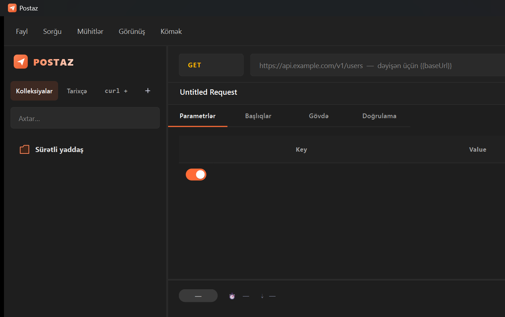

<div align="center">

# Postaz

### A modern, beautiful, fully-offline Postman alternative — built with Python &amp; Qt

<br>

[](https://www.python.org/)
[](https://doc.qt.io/qtforpython-6/)
[](https://www.sqlite.org/)
[](LICENSE)
[]()

<br>

[](https://kofe.al/goshgarhasanov)
[](https://github.com/goshgarhasanov/postaz_api_tester/stargazers)

<br>

**Send HTTP requests. Organize collections. Test APIs.**
**Locally, offline, privately.**

[🇬🇧 English](#-english)  ·  [🇦🇿 Azərbaycanca](#-azərbaycanca)  ·  [🇹🇷 Türkçe](#-türkçe)

<br>



</div>

---

## 🇬🇧 English

### Why Postaz?
Postman is great until it asks you to sign in, sync everything to the cloud, throttle your free workspace, or fight you for 800 MB of RAM. Postaz is the opposite: **one binary, one SQLite file, zero cloud, zero telemetry, three languages.**

### ✨ Features

| | |
|---|---|
| 🚀 **Full HTTP** | GET · POST · PUT · PATCH · DELETE · HEAD · OPTIONS |
| 🔑 **Auth presets** | Bearer · Basic · API Key · None |
| 📦 **Body editors** | JSON (with pretty-print) · raw · urlencoded |
| 🌍 **Environments** | `{{baseUrl}}`, `{{token}}` — substituted at send time |
| 📚 **Collections** | Tree of folders, drag-friendly, context menu |
| 📜 **History** | Last 200 calls, one-click replay |
| 🎨 **Themes** | Dark + Light · toggle with `Ctrl+T` |
| 🌐 **i18n** | English · Azərbaycanca · Türkçe |
| ⚡ **Threaded HTTP** | UI **never** freezes, animated overlay loader |
| 🎯 **cURL import** | Paste a `curl ...` command, get a populated request |
| ✨ **Animations** | Fade-ins, smooth spinners, drop shadows, toast notifications |
| 🔒 **Privacy** | No accounts, no telemetry, no cloud — your data stays on disk |

### 🚀 Installation

```bash
git clone https://github.com/goshgarhasanov/postaz_api_tester.git
cd postaz_api_tester
python -m venv .venv
# Windows:
.\.venv\Scripts\Activate.ps1
# macOS/Linux:
source .venv/bin/activate
pip install -r requirements.txt
python main.py
```

### ⌨️ Keyboard shortcuts

| Action              | Shortcut       |
| ------------------- | -------------- |
| Send request        | `Ctrl + Enter` |
| Save                | `Ctrl + S`     |
| New request         | `Ctrl + N`     |
| Import cURL         | `Ctrl + I`     |
| Environments        | `Ctrl + E`     |
| Toggle theme        | `Ctrl + T`     |
| Quit                | `Ctrl + Q`     |

### 🏗️ Architecture

```
postaz_api_tester/
├── main.py                       Entry point
├── requirements.txt
└── app/
    ├── database.py               SQLite layer (WAL, thread-local conns)
    ├── http_client.py            requests-powered HTTP execution
    ├── env_resolver.py           {{var}} substitution engine
    ├── curl_import.py            cURL → RequestRecord parser
    ├── workers.py                QRunnable HTTP worker (non-blocking)
    ├── i18n.py                   EN/AZ/TR translation table
    └── ui/
        ├── main_window.py        Top-level shell, menus, splitters
        ├── sidebar.py            Collections tree + history list
        ├── request_editor.py     Method/URL + Params/Headers/Body/Auth
        ├── response_viewer.py    Status + body + headers + raw
        ├── dialogs.py            Save dialog, environments, About
        ├── import_dialog.py      cURL paste-and-import surface
        ├── widgets.py            Spinner, Toast, StatusBadge, KVTable
        ├── animations.py         Fade, slide, pulse helpers
        ├── icons.py              Programmatically painted icons + app icon
        ├── logo.py               Brand wordmark widget
        └── styles.py             Dark + Light QSS themes
```

### 💖 Support

If Postaz saves you a few seconds every day, consider buying me a coffee — it keeps the project moving.

<a href="https://kofe.al/goshgarhasanov">
  
</a>

### 📜 License

MIT — see [LICENSE](LICENSE). Built by **[goshgarhasanov](https://github.com/goshgarhasanov)**.

---

## 🇦🇿 Azərbaycanca

### Postaz nədir?
Postman gözəldir — ta ki sizdən qeydiyyat tələb etməyə, hər şeyi buluda sinxronlaşdırmağa, pulsuz workspace-i məhdudlaşdırmağa və 800 MB RAM yeməyə başlayana qədər. **Postaz** isə bunun əksidir: bir tək tətbiq, bir tək SQLite faylı, sıfır bulud, sıfır telemetriya, üç dil dəstəyi.

### ✨ Xüsusiyyətlər

| | |
|---|---|
| 🚀 **Tam HTTP** | GET · POST · PUT · PATCH · DELETE · HEAD · OPTIONS |
| 🔑 **Auth tipləri** | Bearer · Basic · API Açarı · Heç biri |
| 📦 **Gövdə redaktoru** | JSON (pretty-print ilə) · xam · urlencoded |
| 🌍 **Mühitlər** | `{{baseUrl}}`, `{{token}}` — sorğu göndərilərkən əvəzlənir |
| 📚 **Kolleksiyalar** | Qovluq ağacı, kontekst menyusu |
| 📜 **Tarixçə** | Son 200 sorğu, bir klik ilə yenidən oynat |
| 🎨 **Mövzular** | Tünd və Açıq · `Ctrl+T` ilə dəyiş |
| 🌐 **Dillər** | English · Azərbaycanca · Türkçe |
| ⚡ **Paralel HTTP** | İnterfeys **heç vaxt** donmur, animasiyalı overlay loader |
| 🎯 **cURL idxalı** | `curl ...` əmrini yapışdırın — hazır sorğu alın |
| ✨ **Animasiyalar** | Fade keçidlər, hamar spinnerlər, kölgələr, toast bildirişləri |
| 🔒 **Məxfilik** | Hesab yox, telemetriya yox, bulud yox — datalarınız sizdə qalır |

### 🚀 Quraşdırma

```bash
git clone https://github.com/goshgarhasanov/postaz_api_tester.git
cd postaz_api_tester
python -m venv .venv
# Windows:
.\.venv\Scripts\Activate.ps1
# macOS/Linux:
source .venv/bin/activate
pip install -r requirements.txt
python main.py
```

### ⌨️ Klaviatura qısayolları

| Əməliyyat              | Qısayol        |
| ---------------------- | -------------- |
| Sorğunu göndər         | `Ctrl + Enter` |
| Yadda saxla            | `Ctrl + S`     |
| Yeni sorğu             | `Ctrl + N`     |
| cURL idxal et          | `Ctrl + I`     |
| Mühitlər               | `Ctrl + E`     |
| Mövzunu dəyiş          | `Ctrl + T`     |
| Çıxış                  | `Ctrl + Q`     |

### 💖 Dəstək

Əgər Postaz hər gün sizə bir neçə saniyə qənaət edirsə, mənə bir qəhvə ala bilərsiniz — bu, layihənin davam etməsinə kömək edir.

<a href="https://kofe.al/goshgarhasanov">
  
</a>

### 📜 Lisenziya

MIT — [LICENSE](LICENSE) faylına baxın. Hazırlayıb: **[goshgarhasanov](https://github.com/goshgarhasanov)**.

---

## 🇹🇷 Türkçe

### Postaz nedir?
Postman, sizden kayıt olmanızı isteyene, her şeyi buluta senkronlayana, ücretsiz workspace'i kısıtlayana ve 800 MB RAM yiyene kadar harikadır. **Postaz** ise bunun tam tersi: tek bir uygulama, tek bir SQLite dosyası, sıfır bulut, sıfır telemetri, üç dil desteği.

### ✨ Özellikler

| | |
|---|---|
| 🚀 **Tüm HTTP** | GET · POST · PUT · PATCH · DELETE · HEAD · OPTIONS |
| 🔑 **Kimlik doğrulama** | Bearer · Basic · API Anahtarı · Yok |
| 📦 **Gövde editörü** | JSON (biçimlendirme ile) · ham · urlencoded |
| 🌍 **Ortamlar** | `{{baseUrl}}`, `{{token}}` — istek sırasında yerine konulur |
| 📚 **Koleksiyonlar** | Klasör ağacı, sağ tık menüsü |
| 📜 **Geçmiş** | Son 200 istek, tek tıkla tekrar oynat |
| 🎨 **Temalar** | Koyu ve Açık · `Ctrl+T` ile değiştir |
| 🌐 **Diller** | English · Azərbaycanca · Türkçe |
| ⚡ **İş parçacıklı HTTP** | Arayüz **asla** donmaz, animasyonlu overlay yükleyici |
| 🎯 **cURL içe aktar** | `curl ...` komutunu yapıştır — hazır istek al |
| ✨ **Animasyonlar** | Fade geçişler, yumuşak spinnerlar, gölgeler, toast bildirimleri |
| 🔒 **Gizlilik** | Hesap yok, telemetri yok, bulut yok — verileriniz sizde kalır |

### 🚀 Kurulum

```bash
git clone https://github.com/goshgarhasanov/postaz_api_tester.git
cd postaz_api_tester
python -m venv .venv
# Windows:
.\.venv\Scripts\Activate.ps1
# macOS/Linux:
source .venv/bin/activate
pip install -r requirements.txt
python main.py
```

### ⌨️ Klavye kısayolları

| İşlem                  | Kısayol        |
| ---------------------- | -------------- |
| İsteği gönder          | `Ctrl + Enter` |
| Kaydet                 | `Ctrl + S`     |
| Yeni istek             | `Ctrl + N`     |
| cURL içe aktar         | `Ctrl + I`     |
| Ortamlar               | `Ctrl + E`     |
| Temayı değiştir        | `Ctrl + T`     |
| Çıkış                  | `Ctrl + Q`     |

### 💖 Destek

Postaz her gün size birkaç saniye kazandırıyorsa, bana bir kahve ısmarlayabilirsiniz — projeyi yaşatmama yardımcı olur.

<a href="https://kofe.al/goshgarhasanov">
  
</a>

### 📜 Lisans

MIT — [LICENSE](LICENSE) dosyasına bakın. Geliştiren: **[goshgarhasanov](https://github.com/goshgarhasanov)**.

---

<div align="center">

**Built with ❤️ by [goshgarhasanov](https://github.com/goshgarhasanov)**

⭐ **If you find Postaz useful, please star the repo!**

</div>
